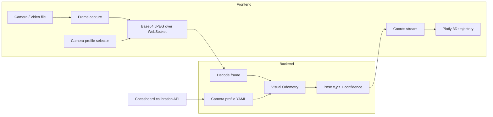

# About the Project

## Real-Time Monocular Visual Odometry

This project is a web-based **monocular visual odometry (VO)** system. It estimates camera motion in 3D from a **single video stream** or a pre-recorded video file, and visualizes the trajectory in the browser in real time.

The system is designed for scenarios such as UAV flight in GPS-denied environments, but it works with any monocular camera source (webcam, file, etc.).

---

## System Pipeline

The application follows a **client–server** architecture. Perception runs on the Python backend; the Angular frontend handles capture, configuration, and visualization.



### Step-by-step flow

1. **Setup (frontend)**  
   The user selects an input mode:
   - **Stream** — live webcam  
   - **From file** — uploaded video  

   Before starting VO, the user must choose a **camera calibration profile** (intrinsic parameters). Profiles can be created via chessboard calibration or loaded from saved YAML files.

2. **Start VO**  
   When the user clicks **Start VO!**, the workspace opens and the frontend connects to:

   `ws://<backend>/ws/vo-stream?config_id=<profile_id>`

3. **Frame loop (request–response)**  
   - The frontend captures a frame, encodes it as JPEG (base64), and sends it over WebSocket.  
   - The backend decodes the image, runs one VO iteration in a worker thread (`asyncio.to_thread`), and replies with JSON:

     `{ "x", "y", "z", "confidence", "tracking" }`

   - The frontend appends the point to a Plotly `scatter3d` trace and sends the next frame.  
   - A watchdog retries the loop if the backend is slow, so tracking does not stall silently.

4. **Configuration storage (backend)**  
   Camera profiles are stored as YAML under `vo-uav/storage/configs/`. Each profile contains intrinsics, optional distortion coefficients, VO tuning parameters, and calibration metadata (resolution, reprojection error, etc.).

---

## Visual Odometry Algorithm

The backend implements a **lightweight incremental monocular VO** pipeline inspired by ideas from PTAM and ORB-SLAM (frame-to-frame tracking, feature replenishment, periodic refresh), optimized for real-time WebSocket inference rather than full SLAM.

### Coordinate system

OpenCV camera coordinates are used internally:

| Axis | Direction |
|------|-----------|
| **X** | Right in the image |
| **Y** | Down in the image |
| **Z** | Forward (into the scene) |

The 3D plot labels match this convention: X (Right), Y (Down), Z (Forward).

### Pinhole camera model

Each frame is processed with a calibrated intrinsic matrix **K**:

$$
K = \begin{bmatrix} f_u & 0 & c_u \\ 0 & f_v & c_v \\ 0 & 0 & 1 \end{bmatrix}
$$

- \(f_u, f_v\) — focal lengths in pixels  
- \(c_u, c_v\) — principal point (optical center) in pixels  

If distortion coefficients are stored in the profile, frames are undistorted with `cv2.undistort` before tracking.

When the live frame resolution differs from the calibration resolution, **K** is scaled to match the incoming frame size so geometry remains consistent.

### Per-frame processing pipeline

```
Input frame (grayscale)
    │
    ├─► Adapt intrinsics K to frame resolution (once)
    ├─► Optional undistortion
    │
    ├─► [Bootstrap] Detect Shi–Tomasi corners (goodFeaturesToTrack)
    │
    └─► For each subsequent frame:
            │
            ├─► 1. Track features: Lucas–Kanade optical flow (pyramidal LK)
            │      + forward–backward consistency check (reject bad tracks)
            │
            ├─► 2. Estimate relative pose (previous → current frame)
            │      ├─ Primary: Essential matrix (RANSAC) + recoverPose
            │      └─ Fallback: Affine partial 2D model (planar / pan motion)
            │
            ├─► 3. Estimate translation scale
            │      ├─ Essential path: median triangulation depth ratio
            │      └─ Affine path: median pixel flow magnitude
            │
            ├─► 4. Integrate pose
            │      R ← R_inc · R
            │      t ← t + R · (t_unit · scale)
            │
            ├─► 5. Replenish features in empty image regions
            │
            ├─► 6. Periodic keyframe refresh (re-detect corners)
            │
            └─► 7. Post-process trajectory (EMA smoothing + outlier step rejection)
```

### Feature detection and tracking

- **Detection:** Shi–Tomasi corners via `cv2.goodFeaturesToTrack`.  
- **Tracking:** Pyramidal Lucas–Kanade (`cv2.calcOpticalFlowPyrLK`).  
- **Outlier rejection:** Forward–backward flow — a track is kept only if tracking forward and then backward returns to the original location within a pixel threshold.  
- **Replenishment:** When the tracked set shrinks, new corners are detected in regions not occupied by existing tracks (similar in spirit to ORB-SLAM’s “generous spawning” policy).

### Pose estimation

**Primary method — Essential matrix**

For matched 2D points \(\mathbf{x}_1, \mathbf{x}_2\) in two consecutive frames:

1. Estimate **E** with RANSAC: `cv2.findEssentialMat`  
2. Decompose motion: `cv2.recoverPose` → relative rotation **R** and translation direction **t** (unit length)  
3. Accept the solution only if enough inliers pass RANSAC and cheirality checks  

The essential matrix encodes epipolar geometry:

$$
E = [\mathbf{t}]_\times R
$$

**Fallback — Affine partial model**

Webcam motion is often dominated by translation in the image plane, where cheirality checks on **E** can fail. In that case the system falls back to `cv2.estimateAffinePartial2D` (similarity transform in 2D) and maps the result to a 3D translation primarily in the **X–Y** plane, avoiding artificial forward (Z) drift.

### Monocular scale

Monocular VO recovers translation **direction** but not absolute metric scale. The pipeline uses:

- **Triangulation depth ratio** (essential path) — compares median scene depth between consecutive frames  
- **Median optical-flow magnitude** (affine path) — converts pixel displacement to a small normalized step  

A profile-level `absolute_scale` factor controls overall step size. Scale ratios are clamped per frame to limit drift bursts.

### Keyframe refresh and recovery

- Every **N** frames (configurable), features are re-detected to avoid long-baseline tracking failure.  
- If tracking is lost for several consecutive frames, the system **re-bootstraps** on the current frame instead of freezing.  
- Tracking states returned to the frontend: `initializing`, `ok`, `degraded`, `lost`.

### Post-processing

A **pose smoother** applies exponential moving average (EMA) filtering on the cumulative trajectory and rejects unphysically large per-frame jumps. This reduces visual jitter on the 3D plot without replacing the core VO estimator.

### Known limitations

This is a **VO** system, not full **SLAM**. It does **not** include:

- Loop closure or global map optimization  
- Local bundle adjustment (g2o / Ceres)  
- IMU fusion  

Expect **scale drift** and gradual error accumulation over long paths. Accuracy improves significantly with a **correct camera calibration profile** for the actual device and resolution.

---

## Camera Calibration

Accurate intrinsics are required for reliable geometry. Wrong \(f_u, f_v, c_u, c_v\) leads to incorrect epipolar constraints, bad scale, and distorted trajectories (especially along the forward axis).

### User workflow

1. Print a **chessboard pattern** with known square size (measure in millimeters).  
2. Capture **10–30+ photos** with the **same camera** that will run VO:
   - Different angles and distances  
   - Board fully visible, in focus, not motion-blurred  
3. In the frontend, open **Stream** or **From file** tab → click **+** next to the camera profile dropdown.  
4. In the calibration dialog:
   - Enter a **profile name**  
   - Set **inner corner counts** (OpenCV convention — see below)  
   - Enter **square size in mm**  
   - Upload a **folder** or **multiple images**  
5. Click **Run calibration** — the backend returns estimated intrinsics and reprojection error.  
6. Click **Save profile** — stored as YAML and selectable before starting VO.

### Inner corners vs. squares

OpenCV counts **inner corners**, not squares. For a board with 10×7 squares, the inner corner grid is typically **9×6**:

```
┌─┬─┬─┬─┐
├─┼─┼─┼─┤   ← inner corner at each "plus" intersection
├─┼─┼─┼─┤
└─┴─┴─┴─┘
```

### Calibration algorithm (backend)

Implementation: `vo-uav/src/camera_calibration.py`  
API endpoint: `POST /api/configs/calibrate`

**Input:** multipart form with images + `inner_corners_cols`, `inner_corners_rows`, `square_size_mm`.

**Algorithm:**

1. **Build 3D object points**  
   For an \(C \times R\) inner-corner grid, construct a planar grid in the Z = 0 plane:

   $$
   (X, Y, 0) = (j \cdot s,\ i \cdot s,\ 0), \quad j = 0 \ldots C-1,\ i = 0 \ldots R-1
   $$

   where \(s\) is the physical square size in meters.

2. **For each uploaded image**  
   - Decode to grayscale  
   - Detect corners: `cv2.findChessboardCorners` (adaptive threshold + normalized image)  
   - Sub-pixel refine: `cv2.cornerSubPix`  
   - If detection succeeds, append `(object_points, image_points)` pairs  

3. **Validate**  
   Require at least **3** successful detections (more is better).

4. **Optimize intrinsics and distortion**  
   Run OpenCV’s pinhole calibration:

   ```text
   cv2.calibrateCamera(object_points, image_points, image_size, ...)
   ```

   This minimizes **reprojection error** — the RMS pixel distance between observed corner positions and positions projected using the estimated **K** and distortion coefficients.

5. **Output**  
   - \(f_u, f_v, c_u, c_v\) from the camera matrix  
   - Distortion coefficients \((k_1, k_2, p_1, p_2, \ldots)\)  
   - Mean reprojection error (pixels)  
   - Number of images used  
   - Calibration image width and height  

6. **Persist**  
   Saved into a camera profile YAML together with metadata (`source: chessboard`, corner counts, square size, reprojection error). At VO runtime, intrinsics are loaded by `config_id` and scaled if the stream resolution differs from the calibration resolution.

### Interpreting calibration quality

| Reprojection error | Typical quality |
|--------------------|-----------------|
| < 0.5 px | Excellent |
| 0.5 – 1.0 px | Good |
| > 1.5 px | Check board print quality, focus, or corner count settings |

Always calibrate with the **same camera and resolution** used during VO. Using a default dataset profile (e.g. EuRoC) on a laptop webcam will produce approximate but suboptimal trajectories.

---

## Tech Stack

| Layer | Technologies |
|-------|----------------|
| **Backend** | Python, FastAPI, OpenCV, NumPy, PyYAML |
| **Frontend** | Angular 21, TypeScript, Angular Material, Plotly.js |
| **Transport** | WebSocket (full-duplex frame streaming) |
| **Infrastructure** | Docker, Docker Compose, Nginx, Cloudflare Tunnel (optional) |

---

## Project Structure (high level)

```text
Coursework/
├── vo-uav/                 # FastAPI backend — VO, calibration, profiles
│   ├── src/vo.py           # Visual odometry engine
│   ├── src/camera_calibration.py
│   ├── src/routers/stream.py
│   └── storage/configs/    # Saved camera profiles (YAML)
└── vo-frontend/            # Angular SPA — capture, calibrate, visualize
```

---

## References and related work

The VO pipeline draws on well-established ideas from monocular SLAM/VO literature:

- **PTAM** — separate tracking with keyframe-based structure  
- **ORB-SLAM** — robust feature management, relocalization, and map-centric design (this project implements a simplified real-time subset)  
- **OpenCV calibration tutorial** — chessboard-based pinhole camera calibration  

For production-grade accuracy, systems typically add bundle adjustment, loop closure, and/or IMU fusion. This project prioritizes a **real-time, browser-accessible demo** with explicit camera calibration support.
